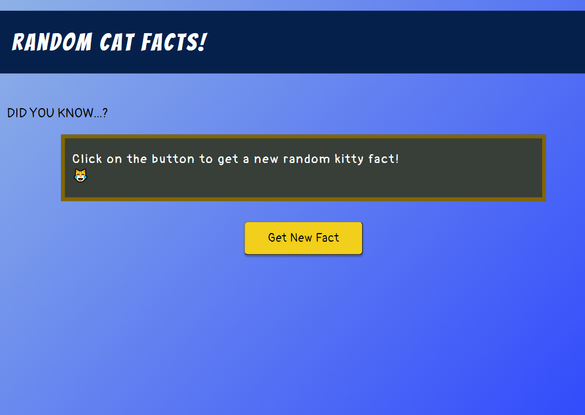
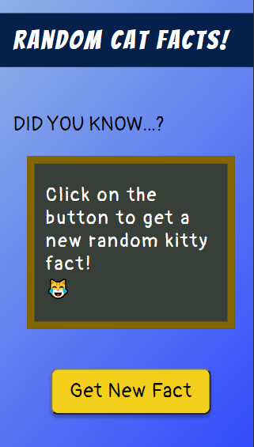

# RANDOM CAT FACTS<!-- omit in toc -->

## Version 1.0<!-- omit in toc -->

- **Project Start:** May 4, 2021
- **Project End:** May 7, 2021

# CONTENTS
- [CONTENTS](#contents)
  - [Introduction](#introduction)
  - [Screenshots](#screenshots)
  - [Methodology](#methodology)
  - [Tools I Used](#tools-i-used)
  - [What I learned](#what-i-learned)
  - [Items for further study / Continued development](#items-for-further-study--continued-development)
  - [Useful resources](#useful-resources)
  - [About me](#about-me)
 

Introduction
---

Following my completion of Module 7 of Scrimba's [Frontend Developer Career Path Bootcamp](https://scrimba.com/learn/frontend), *Working with APIs*, I wanted to further solidify my understanding of the topics covered. So I set about creating this simple App that retrieves random Cat-related facts 🐱

 

Screenshots
---

**DESKTOP:**

 

**MOBILE:**

 

Methodology
---

Originally, I wanted to make an App for random general facts, but I stumbled on the **Cat Facts API**, and changed course.

I then went into Figma to draw up simple layouts for mobile, tablet and desktop. When completed I wrote up the HTML, CSS, and JavaScript files.

 

Tools I Used
---

- HTML5
- CSS (Mobile-first design)
- Vanilla JavaScript
- [Cat Facts API 1.0.0 ](https://catfact.ninja/)

 

What I learned
---

I was going through Figma's tutorials at the time, so it was cool to use it for one of my projects! 

Also, it was nice to get my hands dirty with Fetch API.

 

Items for further study / Continued development
---

I certainly want to improve the layout to make it more visually appealing.

Also, in the future once I'm more familiar with React, I would like to update the App wtih React in mind.

 

Useful resources
---

The following resources were a great help:

- **Scrimba**. This platform is a totally awesome learning tool that's a mix of YouTube tutorials and hands-on learning. The courses that helped me the most are:
  - [The Frontend Developer Career Path](https://scrimba.com/learn/frontend)
  - [The JavaScript Bootcamp](https://scrimba.com/learn/javascript)
  - [The UI Bootcamp](https://scrimba.com/learn/designbootcamp)
  - [From Figma to Code](https://scrimba.com/learn/figmatocode)

 

About me
---

Thanks for checking out this project! You can find my various profiles here:

- Frontend Mentor - [@Infinity-Mineeva](https://www.frontendmentor.io/profile/Infinity-Mineeva)
